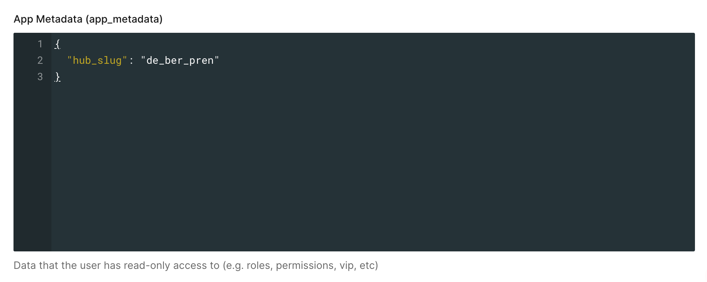

<!-- Improved compatibility of back to top link: See: https://github.com/othneildrew/Best-README-Template/pull/73 -->
<a name="readme-top"></a>
<!--
*** Thanks for checking out the Best-README-Template. If you have a suggestion
*** that would make this better, please fork the repo and create a pull request
*** or simply open an issue with the tag "enhancement".
*** Don't forget to give the project a star!
*** Thanks again! Now go create something AMAZING! :D
-->


<!-- PROJECT LOGO -->
<br />
<div align="center">
  <a href="https://github.com/goflink/flinkord-cli">
    
  </a>

<h3 align="center">Flinkord-CLI</h3>

  <p align="center">
    CLI tool for easy order generation and management
    <br />
    <a href="https://github.com/goflink/flinkord-cli"><strong>Explore the docs »</strong></a>
    <br />
    <br />
    <a href="https://github.com/goflink/flinkord-cli.git">View Demo</a>
    ·
    <a href="https://github.com/goflink/flinkord-cli/issues">Report Bug</a>
    ·
    <a href="https://github.com/goflink/flinkord-cli/issues">Request Feature</a>
  </p>
</div>


<!-- TABLE OF CONTENTS -->
<details>
  <summary>Table of Contents</summary>
  <ol>
    <li>
      <a href="#about-the-project">About The Project</a>
      <ul>
        <li><a href="#built-with">Built With</a></li>
      </ul>
    </li>
    <li>
      <a href="#getting-started">Getting Started</a>
      <ul>
        <li><a href="#prerequisites">Prerequisites</a></li>
        <li><a href="#installation">Installation</a></li>
      </ul>
    </li>
    <li><a href="#usage">Usage</a></li>
    <li><a href="#roadmap">Roadmap</a></li>
    <li><a href="#contributing">Contributing</a></li>
    <li><a href="#contact">Contact</a></li>
    <li><a href="#acknowledgments">Acknowledgments</a></li>
  </ol>
</details>


<!-- ABOUT THE PROJECT -->

## About The Project

[![Product Name Screen Shot][product-screenshot]](https://github.com/goflink/flinkord-cli)

<p align="right">(<a href="#readme-top">back to top</a>)</p>

### Built With

* [![Typescript][Typescript]][typescript-url]
* [![Commander][commander]][commander-url]

<p align="right">(<a href="#readme-top">back to top</a>)</p>


<!-- GETTING STARTED -->

## Getting Started

This is an example of how you may give instructions on setting up your project locally.
To get a local copy up and running follow these simple example steps.

### Prerequisites

This CLI uses internal flink packages, such as `@flink/catalog` and `@flink/hub-manager`. To install them, you might
need to set it up. Please
see [internal documentation](https://goflink.atlassian.net/wiki/spaces/PLATFORM/pages/343343497/Configuring+yarn+npm+registry+to+download+and+publish+packages#Yarn-1-%26-NPM-Usage%3A)
or follow the steps below:

1. Install latest lts version of npm:
   ```shell
   nvm install --lts
   nvm use --lts
   ```
2. Use the npx command to refresh the access token by first installing
    ```shell
    npx google-artifactregistry-auth
    ```
3. Log in on gcloud by running:
   ```shell
   gcloud auth login --project flink-core-staging
   ```
4. Check the file .npmrc in your home directory. If there's no one, create it with the following content:
    ```
   @flink:registry=https://europe-west3-npm.pkg.dev/flink-core-shared/npm-registry/
    //europe-west3-npm.pkg.dev/flink-core-shared/npm-registry/:always-auth=true
   ```
5. Then run from your home directory:
   ```shell
   npx google-artifactregistry-auth --repo-config=.npmrc --credential-config=.npmrc 
   ```

You should see the output:

```
Retrieving application default credentials...
Retrieving credentials from gcloud...
Success!
```

Using this command will produce a token using the information in your `.npmrc` file, and store the token in the `.npmrc`
file located in your user folder.

This method ensures that the authToken is not stored in the `.npmrc` file of your project, which helps prevent it from
being accidentally committed.

### Installation

1. Install the flinkord-cli:
   ```sh
   npm install @flink/flinkord-cli --global
   ```

2. Run the help command to check if everything works:
   ```sh
   flinkord -h
   ```

You should see the following output:

```shell
  _____ _ _       _                 _ 
 |  ___| (_)_ __ | | _____  _ __ __| |
 | |_  | | | '_ \| |/ / _ \| '__/ _` |
 |  _| | | | | | |   < (_) | | | (_| |
 |_|   |_|_|_| |_|_|\_\___/|_|  \__,_|
                                      
Usage: index [options] [command]

A CLI tool for order management

Options:
  -v, --version            Output the current version
  -h, --help               display help for command

Commands:
  create [options]         Create an order with parameters or default values
  free [options]           Free the hub for new operations
  deliver <orderId>        Deliver an order by specifying its ID
  cancel <order>           Cancel an order by specifying its ID
  setup                    Setup environment variables and configurations
  add_shift [options]      Add a shift for Quinyx with a specific user and time range
  delete_shifts [options]  Delete all scheduled shifts from Quinyx
  get_returns <orderId>    Retrieve order returns by specifying order ID
  pick [options]           Pick an order from a specific hub by order number
  help [command]           display help for command
```

<p align="right">(<a href="#readme-top">back to top</a>)</p>

<!-- USAGE EXAMPLES -->

## Usage

Usage: flinkord [options]

### Setup

Before using Flinkord for the first time, you need to set up your credentials and configuration. Run:
```shell
flinkord setup
```
During setup, you can optionally provide your Quinyx credentials to enable shift creation and deletion.

You may also choose to skip this or go forward and use default credentials:

```shell
Do you want to add Quinyx credentials to manage shifts? (yes/no) (default: no): 
```
It will create/update a config file in `~/.flinkord/config.json` in your home directory.

Flinkord will automatically merge default and user configuration files at runtime.

Feel free to manually update `~/.flinkord/config.json` if needed.

To create the order in the chosen hub, please use -h (--hub option):

### Create an order in a particular hub
```shell
flinkord create -h de_ham_winw
```

If you run command without specifying the hub, you'll need to provide the hub in the interactive mode or choose the
default one:


To receive notifications to your email, please use -m (--email option):

### Create an order with your email to receive a receipt

```shell
flinkord create -h de_ham_winw -m myemail@goflink.com
```

### Setting locale for the `create` command
You can specify the locale for your order in two ways:
1. 	Using the **-l** or **--locale** flag
Directly set the desired locale in the format <language>-<region>:
```shell
flinkord create -h de_ham_winw -l en-DE
```
2. Using the **-c** or **--country** flag
   Define the country, and the system will automatically resolve the corresponding locale:
```shell
flinkord create -h de_ham_winw -c de
```


💡 Pro Tip:
Use the --help flag to explore all available options for locale and country values:
```
flinkord create --help
```
This command provides a detailed list of supported locales (e.g., en-DE, nl-NL) and countries (de, nl, fr), helping you configure your orders easily.

### Create an in-store order

To create an in-store order, please use --instore flag:

```shell
flinkord create -h nl_ame_cent --instore
```
In-store orders are available only in a few hubs on staging. Please check with @Anna.Khvorostianova or with the checkout team before using this flag.

### Create an order with clickAndCollect option
To switch on clickAndCollect option, please use -s (--shipping) flag:

```shell
flinkord create -h de_ham_winw -s true
```

### Create an order with particular products in it
To add your items to the cart, use -p flag with the following format:
sku1:quantity1,sku2:quantity2. For example:
```shell
flinkord create -h de_ham_winw -p  11011614:2,11017866:3,11017932:4 
```

### Create an order with a deliveryTag
You can set a deliveryTag to the order. Please use -d or --deliveryTag option with 
the following values:
- outdoor
- home
- work
- other
```shell
flinkord create -h de_ham_winw -d outdoor
```

### Help
Don't hesitate to use help command to discover all possible options:

```shell
flinkord help create
```

or

```shell
flinkord create --help
```

### Deal with _Something went wrong: hub is closed right now_ error

This error often appears when there are too many orders in the hub queue. To free the hub queue, use this command:

```shell
flinkord free -h de_ber_mit2
```

### To pick the order via HubOne API, use "pick" command with your order number and hubSlug:
```shell
flinkord pick -o <order-number> -h <hub-slug>
```
For example,
```shell
flinkord pick -o de-ham-fjpq-q9su -h de_ham_winw
```
Please make sure that your order is eligible for picking, and nobody has started picking it yet!

In case of success, you'll see
```
✔ 🚀 The order de-ham-fjpq-q9su is picked!
🤝 Handover Details 🤝
Container id: 1UO1MIXX
Shelf number: 6
```

If you see an error 
```shell
Error while picking the order. Please see the problem description below
Hub information for 'de_ber_pren' not found. Please check the hubSlug.
```
you can add your hub on your own. Follow these steps:
1. Find coordinates of your hub:
````shell
curl --location 'https://consumer-api.staging.goflink.com/v1/hubs/slug/<hub_slug>'
```` 
2. Add this data to [./src/shared/hubs.ts](./src/shared/hubs.ts)
3. Go to [Auth0 --> Staging --> User Management --> Users](https://manage.auth0.com/dashboard/eu/flink-staging/users)
4. Check if the user for your hub exists. If there's no user with your hub slug found, create a new one:
   1. Click `"+Create User"` button
   2. Enter the email according to the pattern: `hub_slug@goflink.<country_code>`. For example, for de_ber_fran it will be `de_ber_fran@goflink.de`
   3. Enter the password, it should be the same for all hubs: `password123&`
   4. Once the user is created, you need to link it to the hub. Go to App Metadata section and add this piece of JSON:
   ```json
    {
      "hub_slug": "<your_hub_slug>"
    }
    ```
   
   5. Click "Save"
5. Check that the email you saved in Auth0 is the same for this hub in [./src/shared/hubs.ts](./src/shared/hubs.ts).
6. Push changes, ask for review from developer-experience in [#ask-platform](https://goflink.slack.com/archives/C01M4MM051A).

### To stack multiple orders into a delivery proposal

You can now stack multiple orders **before delivery**!

#### Example:

First, create some orders:
```sh
flinkord create -h de_ber_fran
```

Copy the returned order IDs or order numbers and use them in:
```sh
flinkord stack_orders -h de_ber_fran -o <orderId1> <orderId2> <orderId3>
```

#### Output
If everything works correctly, you'll see the following output:

```shell
✅ Proposal sent: 200
🔍 Fetching stack state...
🧱 Stack ID: b3a9914a-a555-4868-a563-373f5a72a9a1
📍 Hub: de_ber_fran
📅 Revision: 1
╔══════════════════════════════════════╤═════╤═══════╤════════════╗
║ Order ID                             │ PDT │ ETA   │ Type       ║
╟──────────────────────────────────────┼─────┼───────┼────────────╢
║ 311c1af3-bbd0-4aef-adff-1c00c8451ad2 │ 10  │ 9.58  │ Main       ║
║ 1416c83c-d42b-47e9-bcaa-34fc06658c19 │ 16  │ 15.27 │ Main       ║
║ a7d8558d-9a0c-45a9-a895-c3e6b01a29f1 │ 25  │ 23.56 │ Main       ║
║ 61530637-6e41-4b32-9eb2-a617a78fc391 │ 30  │ 29.41 │ Main       ║
║ cd0092e2-6a47-4a4c-9b01-7662268dd6cc │ 40  │ 35.17 │ Main       ║
║ 4093f2ce-11be-41f4-8257-100e432c0387 │ 45  │ 40.44 │ Main       ║
║ 6c6b6f06-30ae-4e13-85ba-806c595f9434 │ 50  │ 46.18 │ Main       ║
║ 030b599f-9e91-43f5-9c3d-37b5201b8fe3 │ 60  │ 57.03 │ Main       ║
║ 7c2f1a89-a50e-4947-a89c-af76c99d0966 │ 70  │ 62.88 │ Main       ║
║ cc89585c-e06d-4e6c-9f1c-53e634ac45b4 │ 70  │ 60.85 │ Main       ║
║ 1f3ac236-8c41-4dda-8851-c9d9d14879c2 │ 70  │ 66.55 │ ↳ Indirect ║
║ 4a2bee92-685b-40fd-a1e6-a7466e5c128b │ 80  │ 72.25 │ ↳ Indirect ║
╚══════════════════════════════════════╧═════╧═══════╧════════════╝
```

### To deliver an order, use "deliver" command with an orderId:

```shell
flinkord deliver <orderId>
```
or with the order number:

```shell
flinkord deliver de-ber-nqqa-rkx5
```

### To cancel the order, use "cancel" command with an orderId:

```shell
flinkord cancel <orderId>
```
or with the order number:

```shell
flinkord cancel de-ber-nqqa-rkx5
```
### To get refunds for the particular order, use `get_returns` command:

```shell
flinkord get_returns <orderId>
```
or with the order number:

```shell
flinkord get_returns de-ber-nqqa-rkx5
```

If there are no returned items, you'll receive a message:
```shell
No return info or items found in the order.
```

Otherwise, you'll see the table with all info: 
```shell
Item 1:
type           LineItemReturnItem
id             45cd13a1-0258-4967-b1c5-201755538a26
quantity       1
lineItemId     03f9dd3f-a0fc-4c13-b608-9b401891b6d5
comment        goods_not_on_shelf
shipmentState  Returned
paymentState   Initial
lastModifiedAt 2023-12-04T14:45:49.040Z
createdAt      2023-12-04T14:45:49.040Z


Item 2:
type           LineItemReturnItem
id             82185c4c-a1b4-4eee-b5ae-5703f3adef1e
quantity       3
lineItemId     c2f45231-401d-4c0b-9a24-86e32e8f33a9
comment        goods_not_on_shelf
shipmentState  Returned
paymentState   Initial
lastModifiedAt 2023-12-04T14:45:49.040Z
createdAt      2023-12-04T14:45:49.040Z

```

---

### To add a new shift in Quinyx and bypass device claiming feature, use "add_shift" command with required options:

This command will let you add a new shift. Note that `username`, `password`, and `hub` are mandatory fields.

```shell
flinkord add_shift -u <username> -p <password> -h <hubSlug> [-b <beginDateTime>] [-e <endDateTime>] [-n <badgeNumber>]
```

#### Options:

- `-u, --username <username>`: **[Mandatory]** Username for Quinyx.
- `-p, --password <password>`: **[Mandatory]** Password for Quinyx.
- `-h, --hub <hubSlug>`: **[Mandatory]** The hub for the shift (please make sure that your user has all required permissions).
- `-b, --begin <beginDateTime>`: **[Optional]** Begin date and time for the shift (format: YYYY-MM-DDTHH:mm:ss). Defaults to today at 08:00.
- `-e, --end <endDateTime>`: **[Optional]** End date and time for the shift (format: YYYY-MM-DDTHH:mm:ss). Defaults to today at 21:59.
- `-n, --badge <badgeNumber>`: **[Optional]** Badge number for another user you want to schedule the shift for.

#### Example:

```shell
flinkord add_shift -u my_username -p my_password -h de_ber_mit2 -b 2023-09-29T04:00:00 -e 2023-09-29T23:59:00 -n 101961
```

#### Output:

After running this command, you should see a nicely formatted output:

```shell
📆 Shift Details 📆
Begin Time: 2023-09-29T04:00:00
End Time: 2023-09-29T23:59:00
```

### To delete all shifts for the authorized user, please use 'delete_shifts' command:
```shell
flinkord delete_shifts -u <username> -p <password> -h <hubSlug>
```
---

<p align="right">(<a href="#readme-top">back to top</a>)</p>


<!-- ROADMAP -->

## Roadmap

- [x] "Create" command with default values
    - [x] Implement -h (--hub) option ([HO-1044](https://goflink.atlassian.net/browse/HO-1044))
    - [x] Implement -m (--email) option  ([HO-1070](https://goflink.atlassian.net/browse/HO-1070))
- [x] Deploy artifact to GCP Artifact Registry
- [ ] Support custom config file
- [x] "Cancel" command by order_name
    - [x] Support order_id in "cancel" command

See the [jira story](https://goflink.atlassian.net/browse/HO-1010) for a full list of proposed features (and known
issues).

<p align="right">(<a href="#readme-top">back to top</a>)</p>


<!-- CONTRIBUTING -->

## Contributing

Contributions are what make the Flink community such an amazing place to learn, inspire, and create. Any contributions
you make are **greatly appreciated**.

If you have a suggestion that would make this better, please create a pull request. You can also simply open an issue
with the tag "enhancement".
Don't forget to give the project a star! Thanks again!

1. Create or pick a ticket in [the Jira story](https://goflink.atlassian.net/browse/HO-1010)
2. Create your Feature Branch (`git checkout -b HO-xxxx`)
3. Commit your Changes (`git commit -m 'Add some <your changes>'`)
4. Push to the Branch (`git push origin HO-xxxx`)
5. Open a Pull Request

<p align="right">(<a href="#readme-top">back to top</a>)</p>


<!-- CONTACT -->

## Contact

Anna Khvorostianova - ext-anna.khvorostianova@goflink.com

Project Link: [https://github.com/goflink/flinkord-cli](https://github.com/goflink/flinkord-cli)

<p align="right">(<a href="#readme-top">back to top</a>)</p>


<!-- MARKDOWN LINKS & IMAGES -->
<!-- https://www.markdownguide.org/basic-syntax/#reference-style-links -->

[product-screenshot]: resources/flinkord_screenshot.png

[Typescript]: https://img.shields.io/badge/-Typescript-blue?style=for-the-badge

[typescript-url]: https://www.typescriptlang.org/

[commander]: https://img.shields.io/badge/-Commander-brightgreen?style=for-the-badge

[commander-url]: https://github.com/tj/commander.js


